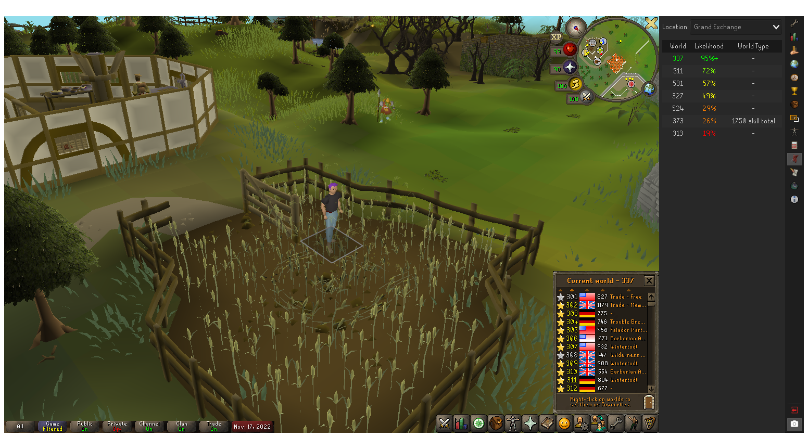

# Crop Circle Tracker Plugin

A RuneLite plugin for crowdsourcing crop circle tracking. Nearby crop circles are detected and reported to a
backend server ([default server](https://github.com/mattjrumble/crop-circle-tracker-server)). The server combines
sightings to calculate the location of crop circles in different worlds. The plugin gets these locations from the
server and displays them in a panel so users can quick-hop to a world where a crop circle is present. Mainly useful
for area-locked/snowflake accounts or for getting the Farmer's Affinity speed boost in Puro-Puro.

### Scouting

The best way to scout crop circle locations is using the Wandering Impling in Zanaris. Just hop through worlds and use
the Wandering Impling each time, and the plugin will detect the crop circle and send that information to the backend
server. Multiple sightings on the same world help to narrow down the timings and make the plugin more accurate.
The default backend server resets sightings every Wednesday at 11:30AM UK time (to match the weekly game update -
which resets all the crop circles). So I wouldn't bother scouting on Wednesday morning.

### Future Improvements

* Use sightings of empty crop circles to narrow down timings (it's annoying when you visit a high likelihood location
and there's no crop circle there, but the likelihood doesn't change to reflect that).
* Make client panel more responsive when a crop circle is found. We could immediately update that row in the panel
instead of submitting to the server, waiting for the server to recalculate, and waiting until we next poll the server.
* Use sightings of crop circles appearing/disappearing to narrow down timings far more than a "static" sighting.
* Use varbit 2180 (which is updated when placing a cannon) to determine the server uptime with server lag accounted for.
Combine this with crop circle sightings to narrow down timings.
* Overworld impling spawn timings are [linked to crop circle timings](https://youtu.be/7Opv5tERDQE?t=1412). The implings 
spawn invisibly every 30 minutes, then turn visible after 2 minutes. The spawn should be synchronized with every other
crop circle rotation (since crop circles rotate every 15 minutes). Detecting an overworld impling spawn or detecting an
overworld impling turning visible could be used to determine the exact crop circle timing on the current world.
